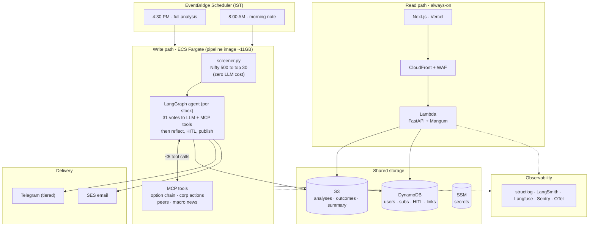
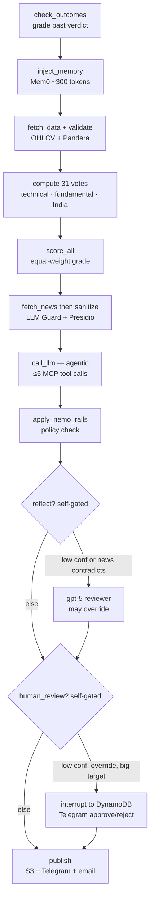
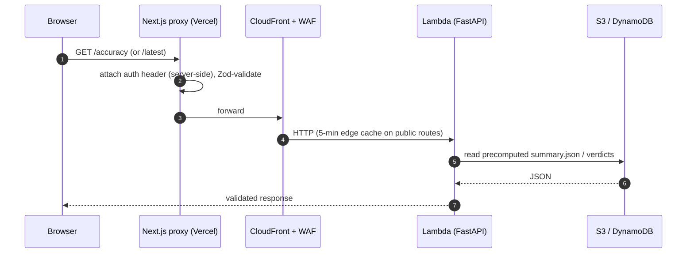
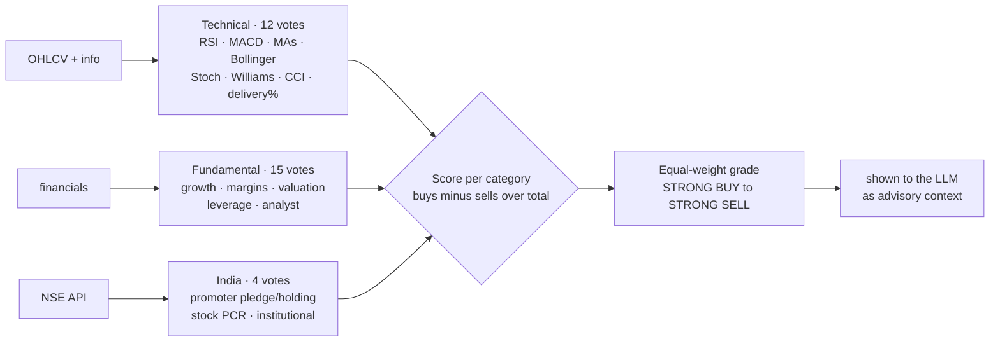
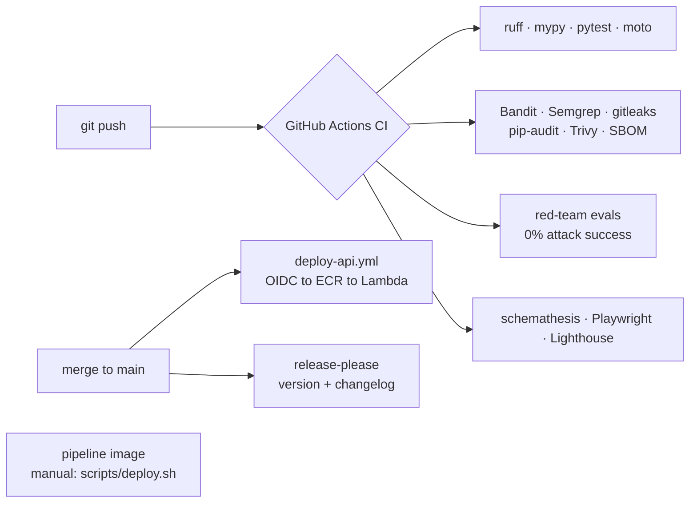

# Indian Stock Analyzer

**An agentic-AI daily stock screener for the Indian (NSE) market — with full explainability and honest, self-tracked accuracy.**

Every weekday after market close, an LLM agent scans the Nifty 500, shortlists ~30 stocks, decides what data it needs, and produces a BUY / HOLD / SELL verdict with entry, stop-loss, target, confidence, and a plain-English explanation — then **grades its own past calls against real prices and publishes the result**.

[](https://github.com/cm-upadhyay/indian-stock-analyzer/actions/workflows/ci.yml)


---

<p align="center">
  <strong>🔗 <a href="https://indian-stock-analyzer-five.vercel.app">Live dashboard</a></strong>
</p>

---

## The problem

A retail investor in India has the same NSE data as an institution but no way to use it: **~2,000 listed tickers**, no time to scan them, read the news on each, and judge buy/hold/sell daily. Existing screeners surface numbers but don't **explain** a pick or ever tell you whether it was **right**.

**Indian Stock Analyzer does the daily scan, explains every call in language a non-trader can read, and — the part most screeners avoid — keeps a public scoreboard of its own directional accuracy.** The "intelligence" isn't a black-box model: 31 rule-based signals produce a structured ballot, and an LLM agent supplies the judgment (does the story justify the math?) with the ability to pull more data on demand.

---

## Key features

- 🤖 **Agentic analysis** — a LangGraph agent decides which extra data to fetch (option chain, corporate actions, peers, macro news) per stock, via MCP tools — not a fixed pipeline
- 🗳️ **31-signal structured scoring** — 12 technical + 15 fundamental + 4 India-specific votes, computed before any LLM sees the stock (auditable, testable, deterministic)
- 📝 **Plain-English verdicts** — BUY/HOLD/SELL with entry, stop-loss, target, confidence, and 5 narrative fields (no indicator jargon)
- 📊 **Self-tracked accuracy** — every verdict graded against real prices 5 trading days out; the number is **public**, whatever it says
- 🧠 **Hierarchical agent memory** — Mem0 episodic/semantic/procedural memory; outcomes feed back so the agent learns from its own hits and misses
- 👤 **Human-in-the-loop** — low-confidence or high-stakes calls pause via LangGraph `interrupt()` for Telegram approval, resumable hours later
- 🛡️ **8-layer guardrail stack** — Pandera → LLM Guard → Presidio → Guardrails AI → NeMo → reflection → HITL → an OWASP red-team CI gate (0% attack success to merge)
- 📨 **Multi-channel delivery** — Telegram (tiered free/Pro) + email + a Next.js dashboard with live SSE progress
- 💸 **Runs on free tiers** — full agentic system at **~$10–14/month** total AWS; **$0 LLM spend** via model tiering, caching, and a budget guard

---

## Highlights

The strongest engineering signals from this project:

- **A production agentic pipeline with durable human-in-the-loop.** The LangGraph agent pauses mid-execution via `interrupt()`, **checkpoints full graph state to DynamoDB**, and resumes hours later from a Telegram button — on a *different* container. This solves the hard problem of long-running agent pauses on ephemeral serverless compute (an earlier SQLite-on-disk checkpointer silently lost state on container recycle).

- **An agentic tool-calling loop with a budget and a safe fallback.** The analyst LLM receives pre-loaded technicals plus an MCP tool catalog and **chooses** what else to fetch — capped at 5 calls, JSON-forced only on the final turn, with a graceful fall-back to a fixed pipeline if the loop fails.

- **Honest, self-correcting evaluation — the integrity highlight.** The accuracy metric once read 66.7%. Verifying it against raw outcome data revealed the grader was measuring at ~1 day, not the 5 trading days the spec required — capturing momentum carryover, not signal. Fixed the grader, backfilled 845 records, and shipped the honest number (**~47–51%, below the 65% target**) to the public page. *A measurement bug is more dangerous than a feature bug — it doesn't crash, it quietly tells you you're winning.*

- **Defense-in-depth LLM safety, gated in CI.** Eight layers from input sanitization (prompt-injection + PII) to output policy rails, plus a 30-case OWASP LLM Top-10 red-team suite that must hit **0% attack success** on every PR — because scraped news headlines are a live prompt-injection surface.

- **Serverless cost engineering.** Two Docker images from one source tree — a slim FastAPI/Lambda read API and an 11 GB ML pipeline on pay-per-run Fargate — keep a full agentic system at ~$10–14/month. LLM cost is **$0**: model tiering (cheap model for bulk, smart model for reflection only), a semantic cache keyed on the rendered prompt, and a daily budget guard, with automatic Gemini fallback.

- **A pure, mockless decision core.** Strict layered architecture (`pipeline → data → indicators → llm → adapters`) where `adapters/` is the only layer that touches the network — so the entire 31-vote scoring engine is unit-tested with **zero mocks, no AWS, no API keys** (~190 tests, ~82% coverage).

---

## Sample output

For each shortlisted stock, the agent emits a structured verdict:

```json
{
  "symbol": "RELIANCE.NS",
  "signal": "BUY",
  "confidence": 0.62,
  "entry": 1420, "stop_loss": 1380, "target": 1475,
  "whats_happening": "The stock is bouncing off a level it has held three times this quarter, on rising volume.",
  "why_it_matters": "Earnings growth is modest but cash flow is strong, and analysts have nudged targets up — the technical bounce has fundamental backing rather than being a dead-cat.",
  "watch_out_for": "Results are due in 6 trading days; a miss would invalidate the setup.",
  "trader_action": "Enter near ₹1420. Stop ₹1380. Target ₹1475 within a week.",
  "investor_action": "Accumulate on dips; the long-term trend is intact above the 200-day average."
}
```

…plus an 8 AM follow-up the next morning judging whether the call is still **INTACT / STRENGTHENED / WEAKENED** against overnight global cues, and an `OutcomeRecord` 5 sessions later grading whether it was right.

---

## How it works — top-level overview



Two runtimes split by job: a **heavy twice-daily batch on Fargate** (produces verdicts) and a **light always-on API on Lambda** (serves them), meeting at S3/DynamoDB. They share one source tree but build into two images (`--group local` vs `--no-group local`).

---

## Architecture deep dive

### 1. The per-stock agentic pipeline (4 PM)



Deterministic data assembly first (fail-safe: missing data → NEUTRAL vote), then the LLM enters at `call_llm` already holding a structured ballot, then a risk-proportional safety funnel (reflect on shaky calls, escalate the scary ones, policy-check everything). *Note: `reflect`/`human_review` are ordinary linear nodes that self-gate internally — not LangGraph conditional edges.*

### 2. A dashboard request (read path)



The browser never calls Lambda directly or holds a secret — it hits same-origin Next.js proxy routes that attach auth server-side and validate with Zod (502 on shape mismatch). The API only *reads* precomputed JSON; the `/accuracy` page serves a single `summary.json` rather than scanning ~600 outcome files per request.

### 3. The 31-vote scoring engine



Every vote is BUY/NEUTRAL/SELL with a hard threshold; **missing data always votes NEUTRAL** (the rule that keeps the pipeline alive on patchy NSE data). Pure functions, zero I/O — tested without mocks. The grade is *advice* to the LLM, which makes the final call and can overrule it on context the votes can't see (e.g. a fraud headline).

### 4. CI/CD pipeline



Cheap checks fail fast; full-LLM golden evals run nightly. The API Lambda auto-deploys via GitHub OIDC (no stored AWS keys); the 11 GB pipeline image deploys manually (its build is too slow for the critical path). `release-please` cuts versioned releases from conventional commits.

### 5. Code organization

```
src/analyzer/
├── pipeline/      # LangGraph graphs + Pydantic state (orchestration only)
│   ├── graph_4pm.py       # 18-node per-stock analysis graph
│   ├── graph_8am.py       # morning follow-up graph
│   ├── state.py           # AnalysisState
│   └── lambda_handlers.py # ECS/Lambda entry points
├── data/          # business-logic assembly → typed Pydantic models
├── indicators/    # PURE functions: technical/fundamental/india/scoring (zero I/O)
├── llm/           # analyst · agent (tool loop) · reviewer · morning · prompt_library
├── memory/        # Mem0 store + MemoryContext (episodic/semantic/procedural)
├── outcomes/      # tracker.py — 5-session grading + accuracy summary
├── guardrails/    # schema_guards (Guardrails AI) + nemo_rails (policy)
├── hitl/          # approver.py — interrupt/resume + DynamoDB checkpointer
├── flags/         # OpenFeature provider (config/flags.yaml)
├── notify/        # telegram (tiered) · email (SES) · subscribers
├── users/         # store + Telegram-to-web account linking
├── adapters/      # the ONLY layer importing yfinance / nse / litellm
├── api/           # FastAPI + Mangum (app.py)
└── utils/         # reliability (tenacity+pybreaker) · storage (S3/local) · cache · budget

src/mcp_server/    # MCP tools — dual-mode (in-process + standalone server)
```

**Imports flow downward only.** `indicators/` is pure Python — the decision core is testable in isolation. `adapters/` isolates all external I/O, so swapping a data or LLM provider is a one-file change.

---

## Results

### Accuracy (the honest headline)

Directional accuracy is graded **forward** — every BUY/SELL verdict is checked against the real close
**5 trading sessions later**, never backtested. The metric is published at `/accuracy`, whatever it says.

| Metric | Value | Target |
|---|---|---|
| Directional accuracy (5-day) | **~47–51%** | ≥ 65% |
| BUY / SELL | ~47% / ~48% | — |
| Confidence calibration | flat (~48% across levels) | informative |
| Verdict mix | ~88% HOLD (thin BUY/SELL denominator) | — |

**This is below target, and that's the point of publishing it.** The number previously read 66.7% — a
measurement artifact (the grader was scoring at ~1 day, capturing momentum carryover, not the 5-day
signal). Catching and correcting that, then shipping the worse-but-true number, is the project's core
discipline. Short-term price direction is inherently hard; the engineering achievement here is the
*honest measurement of it*, not beating the market. See [Accuracy methodology](#accuracy-methodology).

### Engineering

| Metric | Value |
|---|---|
| Universe scanned | Nifty 500 → ~30 shortlisted/day |
| Signals per stock | 31 (12 technical + 15 fundamental + 4 India) |
| 4 PM pipeline run | ~15 min (1 vCPU / 3 GB Fargate) |
| 8 AM morning run | ~1.4 min |
| Tests | ~190, ~82% coverage, run with zero API keys/AWS |
| Total AWS cost | ~$10–14/month · **LLM cost $0** |

---

## Tech stack

### Agentic AI / LLM
- **[LangGraph](https://langchain-ai.github.io/langgraph/)** — agent orchestration with durable DynamoDB checkpointing + `interrupt()`/resume
- **[MCP](https://modelcontextprotocol.io/)** (FastMCP) — tool-calling, dual-mode (in-process + standalone server)
- **[LiteLLM](https://docs.litellm.ai/)** — multi-provider routing (OpenAI primary, Gemini fallback), model tiering
- **[Mem0](https://mem0.ai/)** + **[Qdrant](https://qdrant.tech/)** (ChromaDB local) — hierarchical agent memory
- **Reflection** — smart-model self-critique; **HITL** — human approval via Telegram + LangGraph interrupt

### Safety & evaluation
- **[LLM Guard](https://llm-guard.com/)** + **[Presidio](https://microsoft.github.io/presidio/)** — prompt-injection + PII at input
- **[Guardrails AI](https://www.guardrailsai.com/)** + **[NeMo Guardrails](https://github.com/NVIDIA/NeMo-Guardrails)** — field validators + policy rails
- **[Pandera](https://pandera.readthedocs.io/)** — OHLCV dataframe validation
- **[DeepEval](https://docs.confident-ai.com/)** + **[Braintrust](https://www.braintrust.dev/)** — golden-set eval; **OWASP LLM Top-10** red-team CI gate

### Backend & data
- **[FastAPI](https://fastapi.tiangolo.com/)** + **[Pydantic v2](https://docs.pydantic.dev/)** + **[Mangum](https://mangum.io/)** — API on Lambda; SSE streaming
- **[yfinance](https://github.com/ranaroussi/yfinance)** + NSE API + **[ta](https://github.com/bukosabino/ta)** — market data + technical indicators
- **[tenacity](https://tenacity.readthedocs.io/)** + **[pybreaker](https://github.com/danielfm/pybreaker)** — retry + circuit breakers per provider
- **[OpenFeature](https://openfeature.dev/)** — feature flags (local YAML → Flipt-ready)

### Frontend
- **[Next.js 15](https://nextjs.org/)** (App Router) + **TypeScript** + **[shadcn/ui](https://ui.shadcn.com/)** + **[TanStack Query](https://tanstack.com/query)** + **[Zod](https://zod.dev/)**
- **[Auth.js](https://authjs.dev/)** (Google OAuth) + **[Razorpay](https://razorpay.com/)** subscriptions · deployed on **[Vercel](https://vercel.com/)**

### Infrastructure & observability
- **AWS** — Lambda + **[ECS Fargate](https://aws.amazon.com/fargate/)** + DynamoDB + S3 + SSM + CloudFront + WAF + EventBridge
- **[Terraform](https://www.terraform.io/)** (modules + prod env) · **[GitHub Actions](https://github.com/features/actions)** (OIDC deploy, [release-please](https://github.com/googleapis/release-please))
- **[structlog](https://www.structlog.org/)** → CloudWatch · **[LangSmith](https://smith.langchain.com/)** · **[Langfuse](https://langfuse.com/)** (prompts + traces) · **[Sentry](https://sentry.io/)** · **[OpenTelemetry](https://opentelemetry.io/)** (GenAI spans)
- **[uv](https://docs.astral.sh/uv/)** — dependency management with a `local` group split (slim API image vs full pipeline image)

---

## Getting started

### Prerequisites
- **Python 3.12+** with [uv](https://docs.astral.sh/uv/)
- **Docker** (for the pipeline image / local services)
- An **OpenAI API key** (free data-sharing tier works) — optional **Gemini** key for fallback
- *(Optional)* AWS account only if deploying; **local dev needs no AWS**

### Quick start (local, no AWS, no keys for tests)

```bash
git clone https://github.com/cm-upadhyay/indian-stock-analyzer.git
cd indian-stock-analyzer

uv sync --group dev                 # install deps
cp .env.example .env                # set OPENAI_API_KEY for live runs (not needed for tests)

# Run the test suite — zero API keys, zero AWS (pure indicators + fakes)
uv run pytest --ignore=tests/evals

# Run the pipeline locally on specific symbols (writes JSON under data/, STORAGE_BACKEND=local)
uv run python -m analyzer --symbols RELIANCE,TCS      # --morning for 8 AM note; --dry-run to skip delivery

# Run the API locally (same code Mangum wraps on Lambda)
uv run uvicorn analyzer.api.app:app --reload --port 8000
curl http://localhost:8000/api/v1/health
```

> Local dev uses `STORAGE_BACKEND=local` (JSON under `data/`), auth is open when `NEXTAUTH_SECRET` is
> unset, and Sentry/Langfuse/Mem0 are no-ops without their keys — so the system runs with minimal config.

### Frontend

```bash
cd frontend
cp .env.local.example .env.local    # set API_BASE_URL (e.g. http://localhost:8000)
npm install && npm run dev          # http://localhost:3000
```

### Deploy

```bash
# API Lambda auto-deploys on merge to main (GitHub OIDC). To deploy both images manually:
bash scripts/deploy.sh              # builds + pushes API + pipeline images; updates the API Lambda
# Infra is Terraform: terraform/envs/prod
```

---

## API usage

All user routes are under `/api/v1`. The **accuracy page is public**; other routes accept an Auth.js
JWT (open in local dev when `NEXTAUTH_SECRET` is unset).

```bash
# Public — rolling 30-day accuracy
curl https://<your-cloudfront>/api/v1/accuracy

# Latest verdicts for a date (default: today)
curl https://<your-cloudfront>/api/v1/latest

# One stock's latest verdict
curl https://<your-cloudfront>/api/v1/stock/RELIANCE.NS
```

| Method | Endpoint | Auth | Purpose |
|---|---|---|---|
| `GET` | `/api/v1/health` | none | liveness |
| `GET` | `/api/v1/accuracy` | **public** | rolling 30-day accuracy (precomputed) |
| `GET` | `/api/v1/latest` | tiered | verdicts for a date (free vs Pro) |
| `GET` | `/api/v1/stock/{symbol}` | tiered | one stock's verdict |
| `GET` | `/api/v1/morning` | tiered | 8 AM follow-up notes |
| `GET` | `/api/v1/stream/{symbol}` | user | SSE live analysis progress |
| `GET` | `/api/v1/me` | user | profile + subscription status |
| `POST` | `/api/v1/telegram/webhook` · `/webhooks/razorpay` · `/hitl/{approve,reject}` | secret/key | external callbacks |

---

## Accuracy methodology

How a verdict is graded (`src/analyzer/outcomes/tracker.py`):

- **Direction** — judged at the **close of the 5th trading session** after the verdict (BUY: close > entry; SELL: close < entry). HOLD is direction-neutral. The grade is `None` (provisional) until 5 sessions elapse.
- **Target / stop** — checked against the **intraday High/Low of any session** in the window (path questions, not point-in-time).
- **Frozen when final** — once 5 sessions pass, the record is `final` and never re-evaluated, so a published number can't silently change.
- **Forward, not backtested** — verdicts are graded against a future the system never saw; a backtest would overfit history.

**The bug that overstated it:** the original tracker graded each verdict *once*, at the next time the
screener happened to re-encounter the symbol (~1 day later, 73% of the time), against a single price
snapshot — so it measured momentum carryover, and `target_hit` was structurally impossible. The rewrite
above + a backfill of 845 records produced the honest ~47–51%. Full write-up lives in the engineering
docs. The takeaway: **a measurement bug doesn't crash — it quietly tells you you're winning.**

> ⚠️ **Not financial advice.** This is an informational/educational project. Verdicts are model output,
> not investment recommendations. Past accuracy does not guarantee future results.

---

## Cost to run

| Resource | Monthly | Note |
|---|---|---|
| Lambda (API) + API Gateway | ~$0 | free tier; 1024 MB, low traffic |
| ECS Fargate (pipeline) | ~$0.33 | 2 runs/day × ~15 min × 1 vCPU/3 GB |
| S3 + DynamoDB + SSM | ~$0 | within free tiers |
| CloudWatch + ECR | ~$0–1.5 | logs + image storage |
| **WAF** | **~$5–6** | largest line |
| CloudFront / side-services | ~$4–6 | if observability is self-hosted on Fargate Spot |
| **LLMs** | **$0** | free tiers only (model tiering + cache + budget guard) |
| **Total** | **~$10–14/mo** | vs an ≤$8 aspiration; WAF + side-services dominate |

---

## Project structure

```
indian-stock-analyzer/
├── src/analyzer/        # Python package (see Architecture > Code organization)
├── src/mcp_server/      # MCP tool server (dual-mode)
├── frontend/            # Next.js 15 app (dashboard, accuracy, account, subscribe)
├── terraform/           # modules/ + envs/prod (Lambda, Fargate, DynamoDB, S3, IAM, WAF…)
├── infra/ecs/           # ECS task definitions
├── tests/               # unit (pure) + integration (moto) + evals (golden + red-team)
├── scripts/             # deploy.sh, backfill_outcomes.py, …
├── config/              # settings.yaml + flags.yaml (committed defaults)
├── docs/                # design docs, ADRs, runbooks (gitignored locally)
├── Dockerfile           # slim API image (Lambda)
├── Dockerfile.pipeline  # full ML image (Fargate)
└── pyproject.toml       # uv; `local` dependency group = the ML/safety stack
```

---

## Disclaimer

For learning and research only. **Not financial advice.** Indian markets carry risk; the system owner
is not a registered investment adviser. Use at your own risk. Subscriber data is handled per the India
DPDP Act (see `docs/privacy.md`).

---

## Acknowledgements

- **[NSE](https://www.nseindia.com/)** / **[yfinance](https://github.com/ranaroussi/yfinance)** — market data
- **[LangChain/LangGraph](https://www.langchain.com/)**, **[Anthropic MCP](https://modelcontextprotocol.io/)**, **[Mem0](https://mem0.ai/)** — agent orchestration, tools, memory
- **[Guardrails AI](https://www.guardrailsai.com/)**, **[NVIDIA NeMo Guardrails](https://github.com/NVIDIA/NeMo-Guardrails)**, **[LLM Guard](https://llm-guard.com/)**, **[Presidio](https://microsoft.github.io/presidio/)** — LLM safety
- **[Langfuse](https://langfuse.com/)**, **[LangSmith](https://smith.langchain.com/)**, **[OpenTelemetry](https://opentelemetry.io/)** — observability
- **[Zerodha Varsity](https://zerodha.com/varsity/)** — the technical-analysis grounding behind the indicator logic

---

## License

© 2026 Chandra Mohan Upadhyay. **All rights reserved.**

This repository is published for **viewing and evaluation only** (e.g. portfolio review). It is **not
licensed for reuse** — no permission is granted to use, copy, modify, distribute, or commercialize the
code or its derivatives. For any other use, please get in touch.

